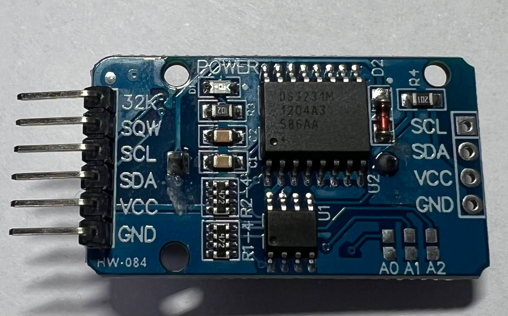
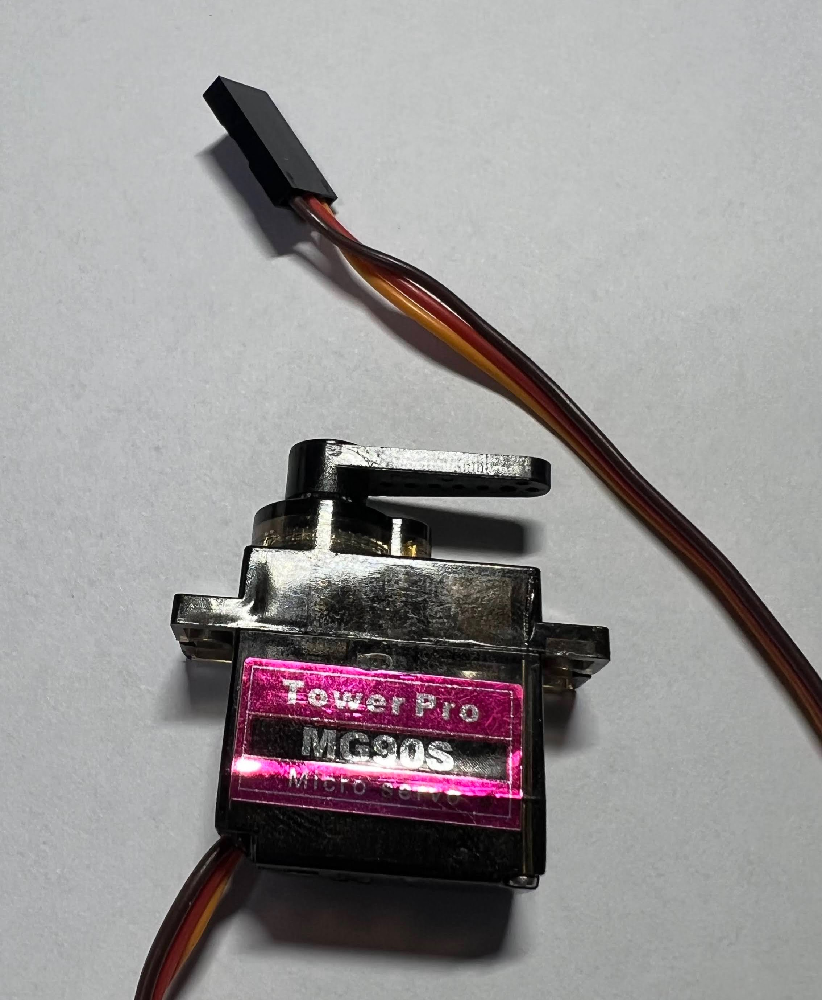
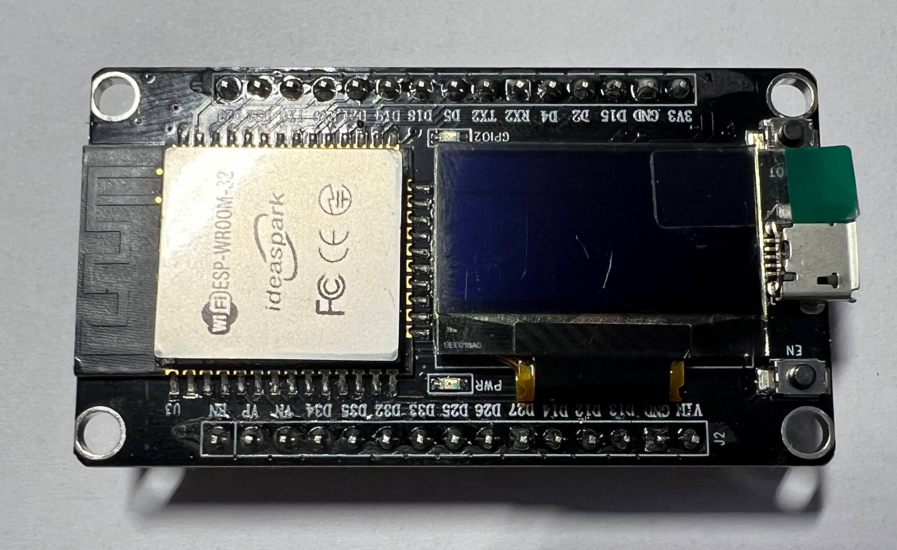
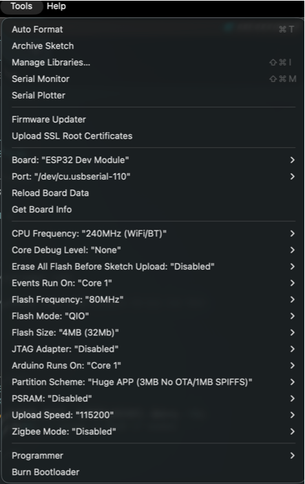
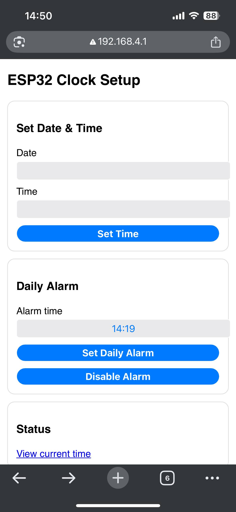

Here is my story.
Like many of us who work from home, after a while, you start to think that a standing desk would be a nice addition to your home setup. And yes, it is, but it’s cool and nice only in the beginning, at least for me. Then I stopped using it, and it became a regular desk, which from time to time served as an expensive lift toy for my daughter… but it looks like she lost interest too.

Unfortunately, the model I got has controls to adjust the height (up and down) and four positions that can be memorized. You find a nice height that works for you, you memorize it, and if you move it up and down later, you can easily return to your desired state. Kind of like a digital radio system.

Turns out, not using your standing desk after a while is a common thing. I’ve checked with many of my friends and colleagues. Okay, let’s automate it. How hard can it be?

We need something that will press the button. We have two options here: you can buy a [Fingerbot](https://www.aliexpress.com/item/1005005923713363.html) for $40 and skip reading the whole saga below, or you can keep reading and spend a few days on it—it's more fun, I can guarantee.

If you’ve made it this far, I assume you’re either curious or you have some extra time to spend. Let’s go!

> _There is a links section in the end of the document where I listed links for each of the parts that I mention in the text_

A servo motor can do the trick, even the cheapest one. Someone needs to give the signal to the motor to start rotating, press the button, and then release it. Okay, any Arduino board will do the trick.

Next, you need to be able to set a time when you want your desk to move to a standing position. For that, you need something that will keep the date/time running and inform the Arduino. Turns out there are tons of components that can do that. I know, ChatGPT told me! I bought a cheap one, the `DS3231`. It can even be attached to a battery, so it won’t lose time if you unplug the power for some reason. Cool! Turns out the same component has an integrated alarm too, so you can set it as well. Perfect.

Imagine you put everything together. You still need a way to attach the motor to the desk controller, drilling or gluing it isn’t an option. After spending 30 minutes measuring and attempting four failed prints, my 3D printer finally managed to produce a perfect piece. Awesome!

[Check it out](https://github.com/stevcooo/AutomatedStandingDesk/blob/main/3DModel/MG50S_servo_mount_to_Strong_standing_desk_controller.stl)

Let’s bring everything together!
I’ve got an ESP32 with WiFi and a display, an MG90S micro servo motor, and a DS3231 for the clock. The good thing about the ESP32 with WiFi is that it can host a network where you can access the Arduino from your phone and set some values, like the date and time, and most importantly, the alarm for when you want the trigger to happen.

I won’t bore you with details here; the whole code is in the repository, where you can go through it or even edit it yourself to tweak it. I’m sure you can make this better!

All the wiring details and technical descriptions are below if you want to go deeper. You can also see the 3D design and edit it to fit your desk or motor.

Now, I set the alarm on the `DS3231` component via the Web interface and my desk is moving to standing position every day, 2minutes before the morning meeting. Yay!

Here is a video how it works in action (you may need to click on the picture to open the YouTube video):
[](https://www.youtube.com/watch?v=pzgJn2215ew)

# ESP32 Daily Alarm Clock + Servo Button Presser

An ESP32-based clock using a DS3231 RTC and SSD1306 OLED display.  
It hosts a Wi‑Fi Access Point with a small web UI to:

- Set date/time on the RTC
- Configure a **daily alarm**
- Disable the alarm
- View current RTC time

When the alarm fires, the DS3231 triggers an interrupt on the ESP32, and the ESP32 drives a servo that “presses a button” (or any physical switch) via a simple press‑and‑return routine.

---

## Features

- **Hardware timekeeping** via DS3231 RTC (battery‑backed)
- **OLED time display** updated once per second
- **Daily alarm** using DS3231 Alarm1 interrupt pin
- **Servo‑triggered action** on alarm
- **Wi‑Fi AP + Web UI** for easy setup without needing a router

---

## Pin Mapping (from the code)

These pins are defined in the sketch:

| Module / Signal       |     ESP32 Pin | Notes                                                |
| --------------------- | ------------: | ---------------------------------------------------- |
| **Servo signal**      |   GPIO **18** | `servoPin = 18`                                      |
| **RTC Alarm INT/SQW** |   GPIO **27** | `ALARM_INT_PIN = 27`, input pullup, falling edge ISR |
| **I2C SDA**           |   GPIO **21** | `Wire.begin(21,22)`                                  |
| **I2C SCL**           |   GPIO **22** | `Wire.begin(21,22)`                                  |
| **OLED I2C addr**     |          0x3C | `OLED_ADDR = 0x3C`                                   |
| **Wi‑Fi AP SSID**     | `ESP32-Clock` | password `12345678`                                  |

RTC and OLED **share the same I2C bus**.

---

## Wiring Table

### 1) DS3231 RTC

<p align="center" width="100%">
   
</p>

| DS3231 Pin | Connect to ESP32 | Notes                                                     |
| ---------- | ---------------- | --------------------------------------------------------- |
| VCC        | 3V3              | DS3231 modules are usually 3.3–5V tolerant; 3V3 is safest |
| GND        | GND              | common ground                                             |
| SDA        | GPIO 21          | I2C data                                                  |
| SCL        | GPIO 22          | I2C clock                                                 |
| INT/SQW    | GPIO 27          | alarm interrupt output                                    |

### 2) Servo (standard 3‑wire)

<p align="center" width="100%">
   
</p>

| Servo Wire                     | Connect to ESP32            | Notes                                                        |
| ------------------------------ | --------------------------- | ------------------------------------------------------------ |
| Signal (usually yellow/orange) | GPIO 18                     | PWM via LEDC                                                 |
| V+ (usually red)               | **5V external** recommended | ESP32 5V pin _might_ work for micro servos but can brown out |
| GND (usually brown/black)      | GND                         | must share ground with ESP32                                 |

> Important: servo power spikes can reset the ESP32. Use a separate 5V supply if possible, and **tie grounds together**.

---

## Graphical Wiring Diagram (Fritzing‑style, text)

Legend:

- `==` I2C bus line (shared)
- `---` single signal line
- `+++` power rail
- `⏚` ground rail

```
                    ┌──────────────────────────────┐
                    │             ESP32            │
                    │                              │
   3V3  +++─────────┤ 3V3                      GND ├────────⏚
                    │                              │
   SDA  ==──────────┤ GPIO21 (SDA)                 │
   SCL  ==──────────┤ GPIO22 (SCL)                 │
 Alarm ---──────────┤ GPIO27                       │
 Servo ---──────────┤ GPIO18 (PWM)                 │
                    └──────────────┬───────────────┘
                                   │
                   ┌───────────────┼
                   │               │
                   │               │
        I2C BUS ===│=== SDA/SCL ===│
                   │               │
                   ▼               ▼

      ┌─────────────────┐   ┌─────────────────┐
      │    DS3231 RTC   │   │      SERVO      │
      │                 │   │                 │
      │ VCC  +++────────┼───│ V+   +++ 5V EXT │
      │ GND  ⏚──────────│───│ GND  ⏚───────── ┼───⏚
      │ SDA  ==─────────┼───│ SIG  --- GPIO18 │
      │ SCL  ==─────────┼───└─────────────────┘
      │ INT  --- GPIO27 │
      └─────────────────┘
```

Power rails:

- **3V3 rail** feeds **RTC VCC** and **OLED VCC**
- **5V external rail** feeds **Servo V+**
- **All grounds join at ESP32 GND**

---

## How It Works

1. **RTC time** is read once per second and drawn on the OLED.
2. **Daily alarm** is set using DS3231 Alarm1 in “match hour/min/sec” mode.
3. When alarm time matches, DS3231 pulls **INT/SQW low**, triggering ESP32 ISR.
4. Main loop sees `alarmFiredFlag` and:
   - clears RTC alarm flag
   - runs `pressAndReturn()` to actuate the servo

Servo routine (timings from code):

- Move “back” for `travelMs`
- Hold for `holdMs`
- Move “press” for `travelMs`
- Stop and settle

You can tune:

```cpp
int pressUs  = 1150;
int backUs   = 1890;
int travelMs = 60;
int holdMs   = 15000;
int settleMs = 200;
```

---

## Setup & Usage

### 1) Flash the ESP32

<p align="center" width="100%">
   
</p>

Open in Arduino IDE (ESP32 core installed), select your board, then upload.

Here is my configuration for the board:

<p align="center" width="100%">
   
</p>

### 2) Connect to AP

On your phone/laptop:

- SSID: **ESP32-Clock**
- Password: **12345678**

### 3) Open Web UI

Navigate to:

- `http://192.168.4.1/`

You’ll see:

- **Set Date & Time**
- **Daily Alarm**
- **Disable Alarm**
- **Status link**

<p align="center" width="100%">
   
</p>

### 4) Status Endpoint

`http://192.168.4.1/status` returns plain text:

```
YYYY-MM-DD HH:MM:SS
```

---

## Notes / Tips

- If your OLED doesn’t show anything, your module may be at **0x3D**; change:
  ```cpp
  const uint8_t OLED_ADDR = 0x3D;
  ```
- DS3231 INT pin is **open‑drain active‑low**, so `INPUT_PULLUP` is correct.
- If the alarm fires immediately after setting:
  - you likely left a stale alarm flag; the code clears alarms on set and on fire.
- Use a proper 5V servo supply for reliability.

---

## Possible Extensions

- Add a “test servo” button to the UI
- Add multiple alarms (Alarm2 or software scheduling)
- Sync time from NTP when connected to the internet
- Show alarm status / next alarm time on OLED
- Draw PCB board where you can put the components directly, something like motherboard

## Links

- [3D model STL](/3DModel/MG50S_servo_mount_to_Strong_standing_desk_controller.stl)
- [3D model online](https://www.tinkercad.com/things/0ZuuW3NavJP-fantabulous-amur-lahdi?sharecode=3iff1eqhTsSEhl9_JkJRbzH8eyOx8h7Foog3UBQTsic)
- [ESP32 Development Board with 0.96 Inch OLED Display](https://www.aliexpress.com/item/1005006269242344.html?spm=a2g0o.order_list.order_list_main.90.ea711802LYOdQG)
- [Micro Servo MG90S](https://www.aliexpress.com/item/32945021008.html)
- [DS3231](https://www.aliexpress.com/item/1005006996032750.html)
- [PCB Board Protoboard For Arduino](https://www.aliexpress.com/item/32981958921.html)
